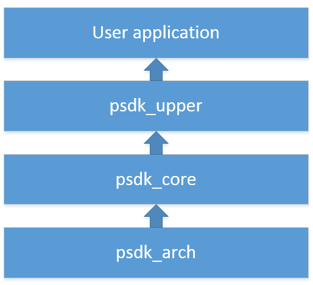

# Introduction
## Payload SDK Architecture

PSDK (Payload SDK) basically allows users to develop their own payload that can use the power and communications resources of DJI drone system
(drone, remote controller and mobile app). As illustrated in the following diagram, PSDK (Payload SDK) API includes three layers:

\ref psdk_arch/arch_template "psdk_arch" : it is the PSDK platform wrapper layer, which is used to port payload SDK to different platforms.

psdk_core(not covered by this doc) : it is the PSDK low layer to deal with PSDK protocol parse, protocol packages and debugging.

\ref psdk_upper/src  "psdk_upper" : it is the psdk function layer. User can call these layer interface fuctions to use PSDK functionality.

User application : it is user's application which uses PSDK API for meeting the needs of the user's application. 

---

## Q & A
### How is Payload SDK ported to your own platform?

Referring to psdk_arch/arch\_template, add your platform arch code. We already provide mcu-bare-metal linux and some rtos arch code.

---

